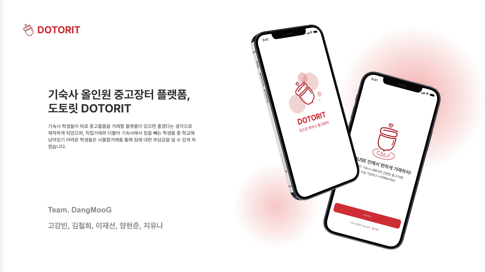
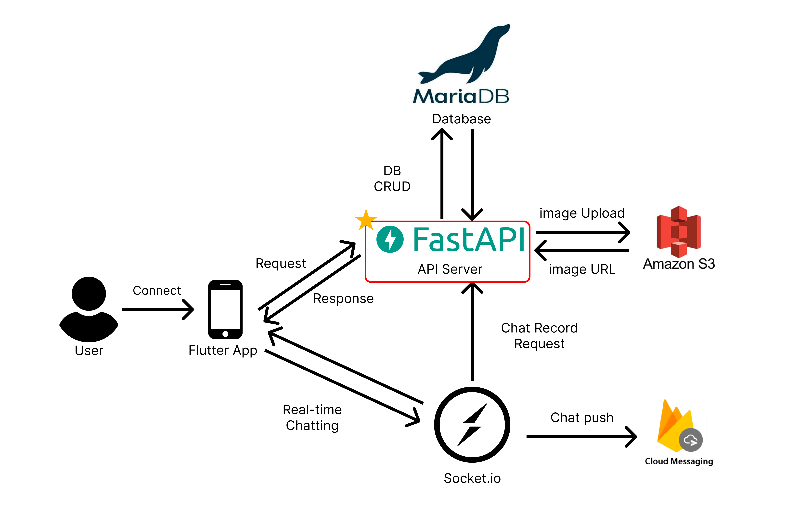
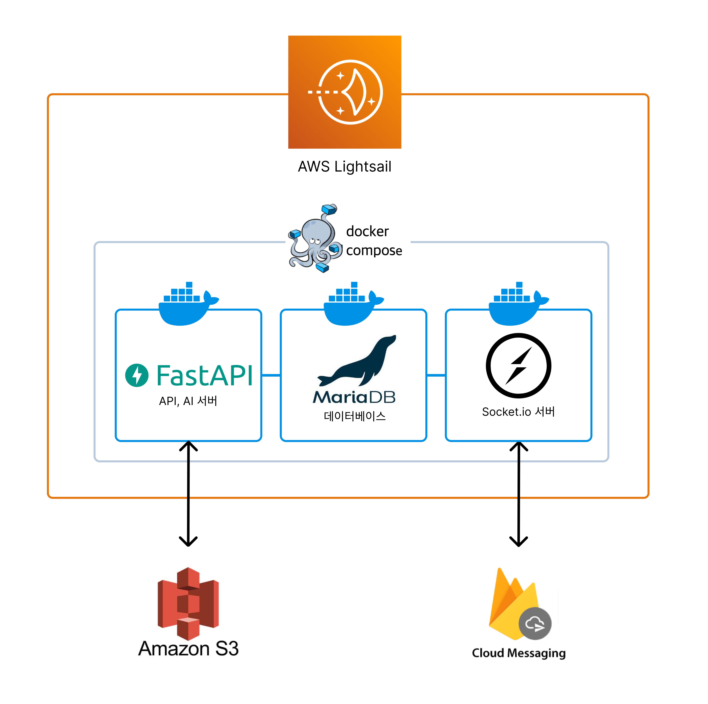
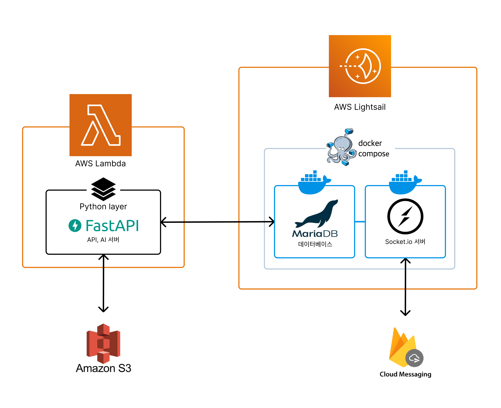
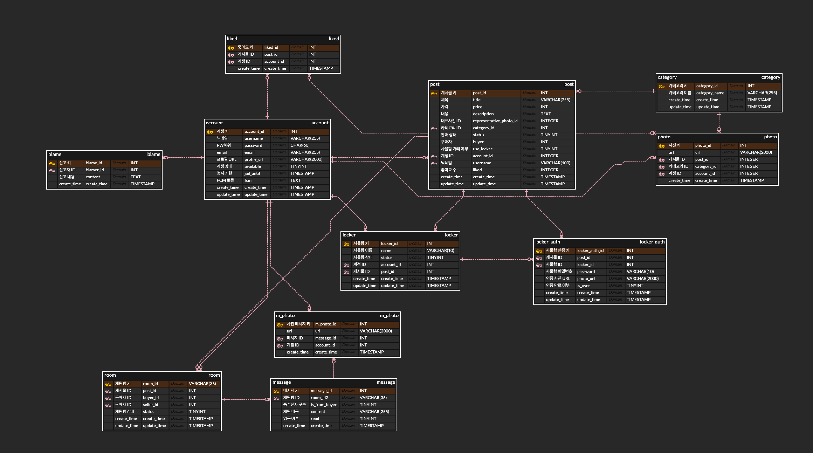

# DangMooG 중고장터 프로젝트 API 서버
[한국어](./README.md)  | [日本語](./README_JP.md)


GIST의 원내 중고장터 플랫폼 '도토릿'의 FastAPI를 사용하여 구현된 백엔드 API 서버입니다. 
<br> 계정, 게시물, 보관함 관리, 채팅기록 다양한 데이터들을 관리하는 역할을 합니다.

## 배포 구조

백엔드 서비스에서 API 서버를 담당하고 있습니다. 다른 모든 백엔드 스택과 소통하며 중계자 역할을 수행합니다.
### AWS Lightsail 기반

### AWS Lambda 추가 적용 기반


## 주요 기능
- **사용자 관리**: 사용자 등록, 로그인, 정보 조회 및 수정 기능
- **포스트 관리**: 사용자들이 포스트를 작성, 조회, 수정 및 삭제할 수 있는 기능
- **카테고리 관리**: 포스트의 카테고리를 관리할 수 있는 기능
- **사진 업로드**: 사용자 및 포스트에 사진을 업로드할 수 있는 기능
- **채팅 기능**: 사용자 간의 실시간 채팅 기능
- **보관함 기능**: 사용자가 보관함에 아이템을 추가, 삭제할 수 있는 기능

## 사용된 기술
- **프레임워크**: FastAPI
- **데이터베이스**: SQLAlchemy를 사용한 MariaDB(MySQL)
- **스키마 유효성 검사 및 직렬화**: Pydantic
- **기타**: JWT (JSON Web Tokens)를 사용한 인증

## 주요 파일 구조
```
DangMooG_server/
├── main.py             # FastAPI 앱의 진입점
├── core/
│   ├── crud.py
│   ├── db.py
│   ├── schema.py
│   └── utils.py
├── models/             # 데이터베이스 모델
│   ├── account.py
│   ├── category.py
│   ├── chat.py
│   ├── liked.py
│   ├── locker.py
│   ├── photo.py
│   └── post.py
├── routers/            # 라우터 모듈
│   ├── account.py
│   ├── category.py
│   ├── chat.py
│   ├── locker.py
│   ├── photo.py
│   └── post.py
├── schemas/            # Pydantic 스키마
│   ├── account.py
│   ├── category.py
│   ├── chat.py
│   ├── chat_photo.py
│   ├── locker.py
│   ├── photo.py
│   └── post.py
├── requirements.txt    # 의존성
├── Dockerfile          # Docker 이미지 빌드 설정
└── docker-compose.yaml # Docker Compose 설정
```

## 데이터베이스 구조
주요 테이블과 각 테이블의 필드는 다음과 같습니다


### 테이블 기능

#### `post` 테이블
- 포스트 정보 저장: 사용자가 게시한 포스트의 제목, 가격, 설명, 상태, 작성자 등의 정보를 저장

#### `account` 테이블
- 사용자 계정 관리: 사용자 계정 정보, 비밀번호, 이메일, 프로필 URL, 계정 상태 등을 저장

#### `chat` 테이블
- 채팅 메시지 저장: 사용자가 주고받은 채팅 메시지와 관련된 정보를 저장

#### `photo` 테이블
- 사진 관리: 포스트, 카테고리, 계정과 관련된 사진 URL을 저장

#### `chatphoto` 테이블
- 채팅 사진 관리: 채팅 메시지에 포함된 사진의 URL을 저장

#### `category` 테이블
- 카테고리 관리: 포스트의 카테고리를 정의하고 저장

#### `liked` 테이블
- 좋아요 기록 관리: 사용자와 포스트 간의 좋아요 관계를 저장

#### `locker` 테이블
- 사물함 관리: 사용자가 이용하는 사물함의 상태와 관련된 정보를 저장

#### `locker_auth` 테이블
- 사물함 인증 관리: 사물함 이용 시 필요한 인증 정보와 관련된 데이터를 저장

#### `room` 테이블
- 채팅 방 관리: 구매자와 판매자 간의 채팅 방 정보를 저장

#### `message` 테이블
- 채팅 메시지 관리: 특정 채팅 방에서 주고받은 메시지를 저장

#### `m_photo` 테이블
- 메시지 사진 관리: 채팅 메시지에 포함된 사진 URL을 저장

#### `blame` 테이블
- 신고 관리: 사용자가 신고한 내용과 관련된 정보를 저장


## 실행 방법

1. 레포지토리 클론
    ```bash
    git clone https://github.com/DangMooG/DangMooG_server
    cd DangMooG_server
    ```

2. 가상 환경 설정
    ```bash
    python -m venv venv
    source venv/bin/activate  # Windows의 경우 `venv\Scripts\activate`
    ```

3. 필요한 패키지 설치
    ```bash
    pip install -r requirements.txt
    ```

4. 서버를 실행
    ```bash
    uvicorn app:fastapi_app --reload
    ```

5. 브라우저에서 `http://127.0.0.1:8000/docs`로 이동하여 API 문서를 확인할 수 있습니다.

## Docker 사용

1. **docker-compose에 환경변수를 세팅해주세요.**


2. **Docker 이미지를 빌드하고 Docker Compose로 컨테이너 실행해주면 됩니다**:
   ```bash
   docker-compose up --build
   ```
3. 설정한 포트 정보에 맞춰서 배포 상황을 확인할 수 있습니다.
