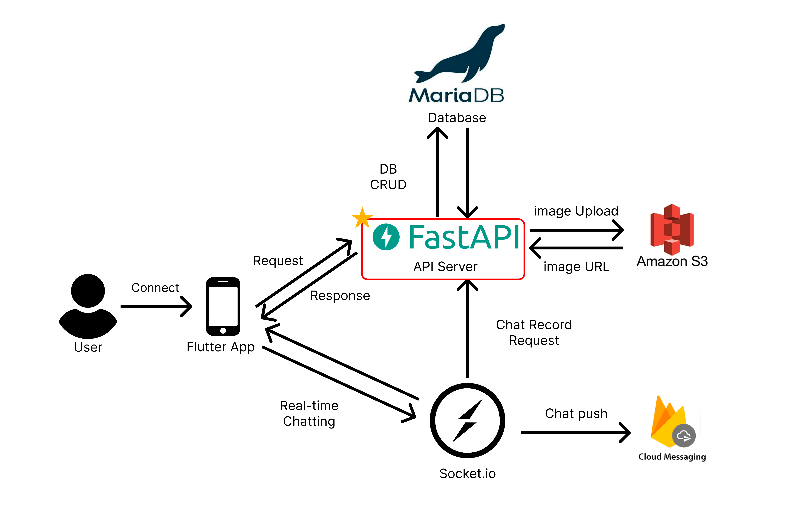
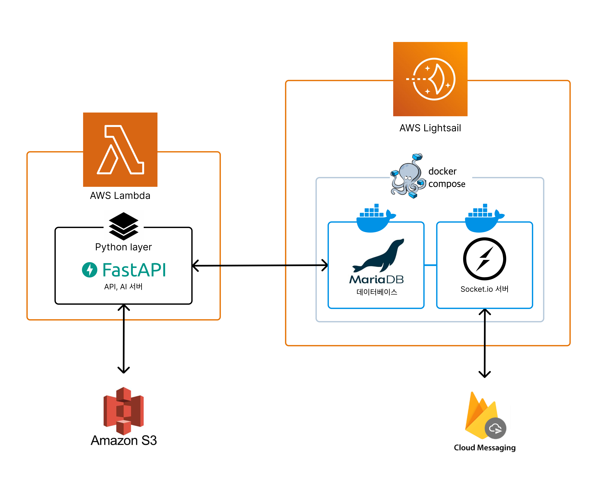
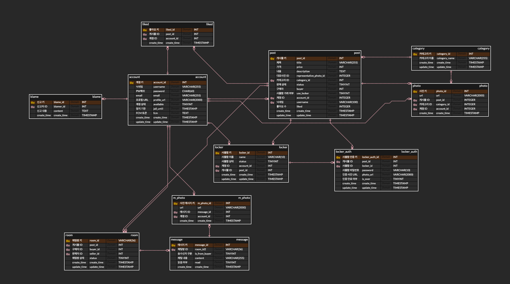

# DangMooG 中古マーケットプロジェクト API サーバー
[日本語](./README_JP.md)  |  [한국어](./README.md)


GISTの学内中古マーケットプラットフォーム「どとりっと」のFastAPIを使用して実装されたバックエンドAPIサーバーです。
<br>アカウント、投稿、ロッカー管理、チャット記録など多様なデータを管理する役割を担います。

## デプロイ構造

バックエンドサービスでAPIサーバーを担当しています。他のすべてのバックエンドスタックと通信し、仲介者の役割を果たします。
### AWS Lightsail 基盤

### AWS Lambda 追加適用基盤


## 主な機能
- **ユーザー管理**: ユーザー登録、ログイン、情報閲覧および修正機能
- **投稿管理**: ユーザーが投稿を作成、閲覧、修正および削除できる機能
- **カテゴリー管理**: 投稿のカテゴリーを管理する機能
- **写真アップロード**: ユーザーおよび投稿に写真をアップロードできる機能
- **チャット機能**: ユーザー間のリアルタイムチャット機能
- **ロッカー機能**: ユーザーがロッカーにアイテムを追加、削除できる機能

## 使用された技術
- **フレームワーク**: FastAPI
- **データベース**: SQLAlchemyを使用したMariaDB(MySQL)
- **スキーマバリデーションおよびシリアライズ**: Pydantic
- **その他**: JWT (JSON Web Tokens)を使用した認証

## 主なファイル構造
```
DangMooG_server/
├── main.py # FastAPIアプリのエントリーポイント
├── core/
│   ├── crud.py
│   ├── db.py
│   ├── schema.py
│   └── utils.py
├── models/ # データベースモデル
│   ├── account.py
│   ├── category.py
│   ├── chat.py
│   ├── liked.py
│   ├── locker.py
│   ├── photo.py
│   └── post.py
├── routers/ # ルーターモジュール
│   ├── account.py
│   ├── category.py
│   ├── chat.py
│   ├── locker.py
│   ├── photo.py
│   └── post.py
├── schemas/ # Pydanticスキーマ
│   ├── account.py
│   ├── category.py
│   ├── chat.py
│   ├── chat_photo.py
│   ├── locker.py
│   ├── photo.py
│   └── post.py
├── requirements.txt # 依存関係
├── Dockerfile # Dockerイメージビルド設定
└── docker-compose.yaml # Docker Compose設定
```

## データベース構造
主要テーブルと各テーブルのフィールドは以下の通りです。


### テーブル機能

#### `post` テーブル
- 投稿情報保存: ユーザーが投稿した投稿のタイトル、価格、説明、状態、作成者などの情報を保存

#### `account` テーブル
- ユーザーアカウント管理: ユーザーアカウント情報、パスワード、メール、プロフィールURL、アカウント状態などを保存

#### `chat` テーブル
- チャットメッセージ保存: ユーザーが送受信したチャットメッセージに関連する情報を保存

#### `photo` テーブル
- 写真管理: 投稿、カテゴリー、アカウントに関連する写真URLを保存

#### `chatphoto` テーブル
- チャット写真管理: チャットメッセージに含まれる写真のURLを保存

#### `category` テーブル
- カテゴリー管理: 投稿のカテゴリーを定義して保存

#### `liked` テーブル
- いいね記録管理: ユーザーと投稿の間のいいね関係を保存

#### `locker` テーブル
- ロッカー管理: ユーザーが利用するロッカーの状態に関連する情報を保存

#### `locker_auth` テーブル
- ロッカー認証管理: ロッカー利用時に必要な認証情報に関連するデータを保存

#### `room` テーブル
- チャットルーム管理: 購入者と販売者間のチャットルーム情報を保存

#### `message` テーブル
- チャットメッセージ管理: 特定のチャットルームで送受信されたメッセージを保存

#### `m_photo` テーブル
- メッセージ写真管理: チャットメッセージに含まれる写真のURLを保存

#### `blame` テーブル
- 報告管理: ユーザーが報告した内容に関連する情報を保存

## 実行方法

1. リポジトリクローン
    ```bash
    git clone https://github.com/DangMooG/DangMooG_server
    cd DangMooG_server
    ```

2. 仮想環境設定
    ```bash
    python -m venv venv
    source venv/bin/activate  # Windowsの場合 `venv\Scripts\activate`
    ```

3. 必要なパッケージインストール
    ```bash
    pip install -r requirements.txt
    ```

4. サーバーを実行
    ```bash
    uvicorn app:fastapi_app --reload
    ```

5. ブラウザで `http://127.0.0.1:8000/docs` に移動してAPIドキュメントを確認できます。

## Docker使用

1. **docker-composeに環境変数を設定してください。**

2. **Dockerイメージをビルドし、Docker Composeでコンテナを実行します**:
   ```bash
   docker-compose up --build

3. 設定したポート情報に合わせてデプロイ状況を確認できます。